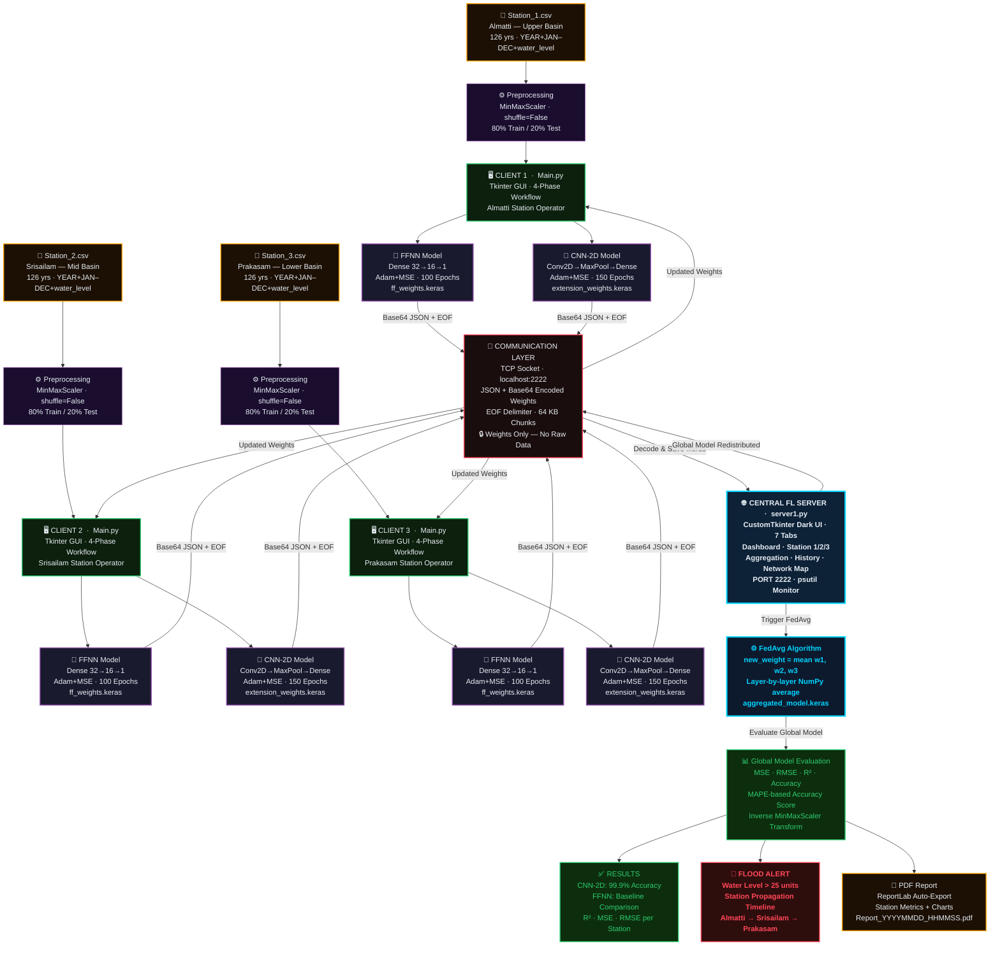

# Flood Forecasting — Federated Learning Architecture

---

## System Layer Breakdown

| Layer | Component | Technology |
|-------|-----------|-----------|
| **Data** | 6 CSVs · 15 cols · 126 yrs/station | Pandas · NumPy |
| **Preprocessing** | MinMaxScaler · shuffle=False · 80/20 split | Scikit-learn |
| **Client** | Main.py · Tkinter 4-phase GUI · Background threading | Python · Tkinter |
| **Local Models** | FFNN (Dense 32→16→1) · CNN-2D (Conv2D+MaxPool) | Keras / TensorFlow |
| **Communication** | TCP Socket · JSON + Base64 + `<EOF>` · Port 2222 | Python socket |
| **Server** | server1.py · CustomTkinter · 7-tab Dashboard | CustomTkinter |
| **Aggregation** | FedAvg · layer-wise NumPy mean of weights | NumPy |
| **Evaluation** | MSE · RMSE · R² · MAPE-based Accuracy | Scikit-learn |
| **Output** | PDF Report · Flood Alert · Live Dashboard | ReportLab · Matplotlib |

> **Privacy Guarantee:** Raw sensor data **never leaves** the client station. Only encoded model weights travel over the network.
